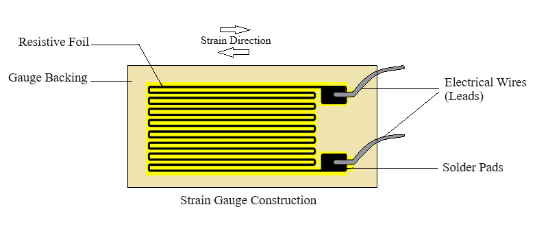

## Introduction

<b>Discipline | <b> Mechanical Engineering 
:--|:--|
<b> Lab | <b> ** Metrology and Measurement Lab**
<b> Experiment|     <b> **Calibration of Strain Gauge and Experiment 4**

### About the Experiment

Strain gauges are widely used instruments for measuring mechanical deformation or strain in materials. When external forces are applied to a stationary object, stress and strain are the result. A Strain gauge is basically a sensor whose resistance varies with applied force. It converts force, pressure, tension, weight etc., into a change in electrical resistance which can then be measured. 

            

<b>Subject matter expertise | <b> **Dr. Poonam Sundriyal**
:--|:--|
<b> Institute | <b>  **Indian Institute of Technology Kharagpur**
<b> Email id|     <b>  **psundriyal@mech.iitkgp.ac.in**
<b> Department |  **Department of Mechanical Engineering**
<b>Webpage| <b> [https://www.iitkgp.ac.in/department/ME/faculty/me-psundriyal](https://www.iitkgp.ac.in/department/ME/faculty/me-psundriyal)

<b>Subject matter expertise | <b> **Dr. Siddharth Tamang**
:--|:--|
<b> Institute | <b>  **Indian Institute of Technology Kharagpur**
<b> Email id|     <b>  **stamang@mech.iitkgp.ac.in**
<b> Department |  **Department of Mechanical Engineering**
<b>Webpage| <b> [https://www.iitkgp.ac.in/department/ME/faculty/me-stamang](https://www.iitkgp.ac.in/department/ME/faculty/me-stamang)

<b>Subject matter expertise | <b> **Prof. Cheruvu Siva Kumar**
:--|:--|
<b> Institute | <b>  **Indian Institute of Technology Kharagpur**
<b> Email id|     <b>  **kumar@mech.iitkgp.ac.in**
<b> Department |  **Department of Mechanical Engineering**
<b>Webpage| <b> [https://www.iitkgp.ac.in/department/ME/faculty/me-kumar](https://www.iitkgp.ac.in/department/ME/faculty/me-kumar)

### Contributors List

SrNo | Name | VLabs Developer or Integration Engineer | Designation | Department| Institute
:--|:--|:--|:--|:--|:--|
1 | **Piyali Chattopadhyay** | Developer  | Project Scientist | Department of Mechanical Engineering | IIT Kharagpur | 
2 | **Nobel Karmakar** | |Research Scholar | Department of Mechanical Engineering | IIT Kharagpur | 
3 | **Sudhansu Sekhar Nath** | |Research Scholar|  Department of Mechanical Engineering | IIT Kharagpur |
4 | **Subhasis Mahata** | Integration Engineer | Senior Project Scientist | Department of Mechanical Engineering | IIT Kharagpur |