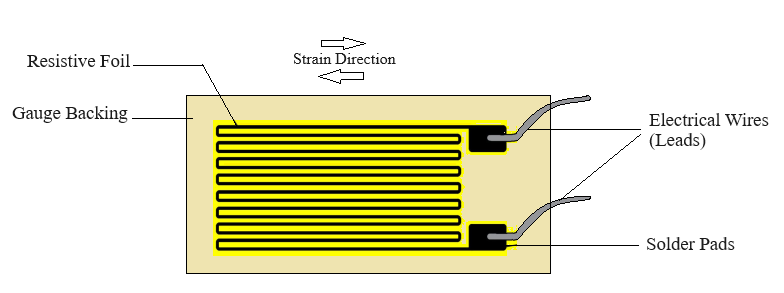

## Introduction

<b>Discipline | <b> Mechanical Engineering 
:--|:--|
<b> Lab | <b> ** Metrology and Measurement Lab**
<b> Experiment|     <b> **Calibration of Strain Gauge and Experiment 4**

### About the Experiment

Strain gauges are widely used instruments for measuring mechanical deformation or strain in materials. When external forces are applied to a stationary object, stress and strain are the result. A Strain gauge is basically a sensor whose resistance varies with applied force. It converts force, pressure, tension, weight etc., into a change in electrical resistance which can then be measured. 

  
<b>Fig. 1. Strain Gauge Construction</b>

