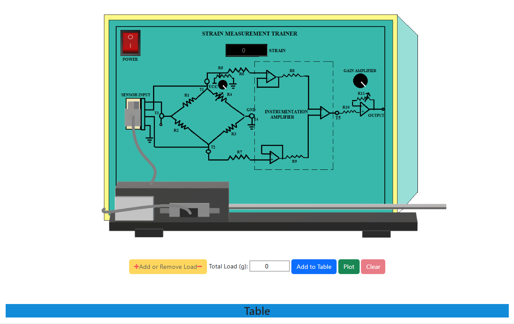

## Procedure

1.	To initiate the experiment, the strain measurement kit, which is provided in the simulation section, is activated by clicking the Power button (Fig. 1). To follow the instructions on the simulation page, please click on the blue ‘Instructions’ tab.

 <b>Fig. 1. Simulation interface for calibration of the strain gauge </b>         

2.	Upon clicking the 'Table' button situated at the bottom of the page, the observation table will show up. To observe the strain in the absence of any load, one must select the 'Add to Table' option. A non-zero value will be displayed as a result of the strain gauge's sensitivity.

3.	To incorporate the load onto the cantilever beam, one must first engage the '+' sign on the 'Add or Remove Load' button, followed by a subsequent click on the 'Add to Table' button to achieve the intended outcome in the observation table for the specified load.

4.	The loads may be adjusted in increments of 100 g by utilizing the '+' and '-' buttons located in the 'Add or Remove Load' tab. Following each alteration of the load, it is imperative to revisit step 3 in order to compile the observation table corresponding to that specific load.

5.	To acquire the graph illustrating the relationship between 'Output Voltage' and 'Applied Load', one must click the 'Plot' button, which is positioned next to the 'Add to Table' button.

6.	Once all the loads are removed from the cantilever beam by utilizing the '-' sign in the 'Add or Remove Load' tab, the trainer kit must be switched off.

7.	The 'clear' button can be pressed to erase all the observation data and plot once the experiment is over. And lastly, for hiding the observation table, one must again click on the 'Table' button.

