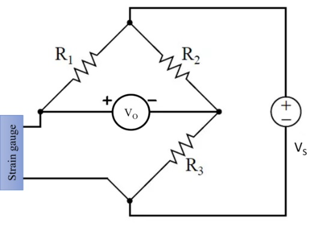
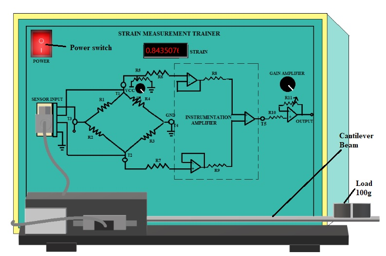

## Procedure

  
Figure 1. Strain-gauge circuit         

1. First switch on the Strain Measurement Trainer kit by clicking on 'Power' button. 

  
 Strain Measurement Trainer Kit in simulation          

2. Click on 'Table' at the bottom of the page to see the observation table and click on 'Add to Table' button to observe the strain without load. Some non zero value will come due to
the sensitivity of strain gauge.

3. Add 100g load to the cantilever beam by clicking on 'Plus' sign on 'Add or Remove Load' button and follow step 2 to get observation for the particular load. 

4. Vary the loads from 100g to 500g by clicking on 'Plus' sign on 'Add or Remove Load' button and follow step 2 to get observation data after each time increasing the load.

5. Click on 'Plot' button to get the plot between 'Output Voltage' Vs. 'Applied load'.

6. Remove the loads one by one by clicking on 'Minus' sign on 'Add or Remove Load' button and switch off the trainer kit.

7. Click on 'Clear' button to erase the observation data and plot. Click on 'Table' button to hide the observation table.

