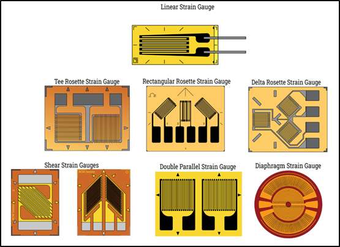
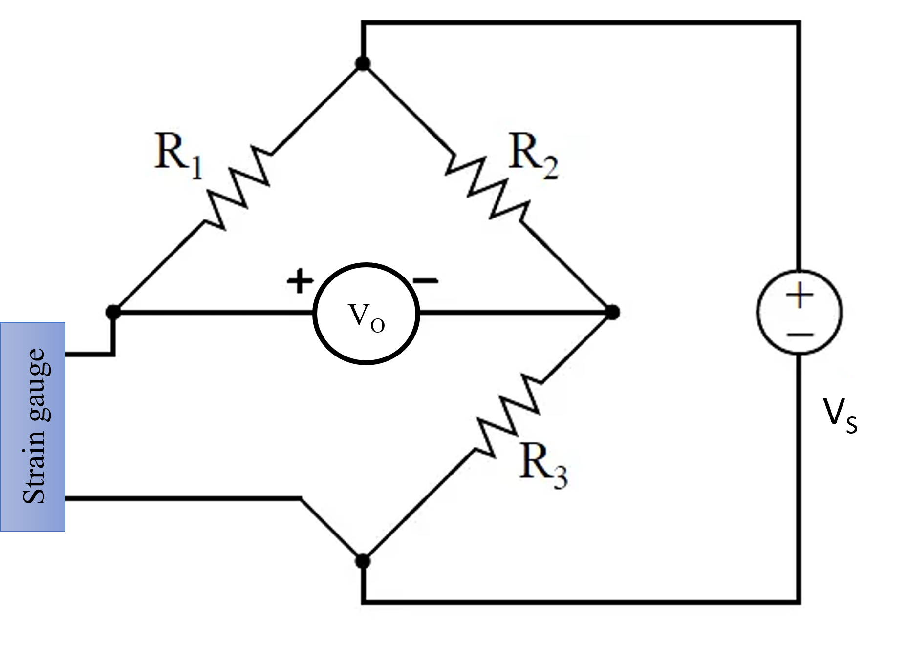

## Theory

Strain gauges are widely used instruments for measuring mechanical deformation or strain in materials. They are based on the principle that the electrical resistance of a conductor changes when subjected to mechanical strain. Various types of strain gauges are displayed in Fig. 1.

<b>Fig. 1. Different types of strain gauges [Ref. 2 (NPTEL Lectures and Websites)]</b>         

Strain gauges are frequently employed to experimentally ascertain the Poisson's ratio of a material. This process generally involves the installation of two strain gauges onto the test specimen. The simultaneous reading of both strains enables the calculation of the ratio. This configuration is commonly integrated within a half-bridge or full-bridge circuit. The precision of strain gauge measurements is affected by a confluence of elements pertaining to the gauge, the surrounding measurement conditions, the material under examination, and the relevant electrical circuitry. Table 1 illustrates the spectrum of sizes and the variety of strains that can be quantified through the utilization of strain gauges. In instances where strain gauges are unavailable, ultrasonic testing emerges as a widely utilized method for evaluating strain within a material.

Calibration of strain gauges is essential to establish a relationship between the applied load and the resulting resistance change. This calibration process allows for the accurate determination of strain values in practical applications. In this experiment, we will explore the fundamental concepts and procedures for strain gauge calibration.

**1. Principles of Strain Measurement:**

**1.1 Piezoresistive Effect**

<b>Fig. 2. Working principle of a strain gauge [Ref. 4 (NPTEL Lectures and Websites)]</b>         

The piezoresistive effect forms the basis for strain gauge operation. When a conductor, typically a metal foil or semiconductor, is subjected to mechanical strain, its electrical resistance changes. This change in resistance is proportional to the strain experienced by the material. This property is exploited for the accurate measurement of strain. The working principle is illustrated in Fig. 2. 

<table style="border: 1px solid black;border-collapse: collapse;width:59.2%;margin-left: auto;margin-right: auto;">

<tr style="border-bottom: 1px solid black;">
    <th colspan=3 style="text-align:center"><b>Table 1:</b> Typical size and strain range of strain gauges</th>
    </tr>
  <tr style="border-bottom: 1px solid black;width:33.33%">
    <th style="border-right: 1px solid black;">Aspect</th>
    <th style="border-right: 1px solid black;">Typical value</th> 
    <th style="border-right: 1px solid black;">Remarks</th>
  </tr>
  <tr style="border-bottom: 1px solid black;width:33.33%">
    <td style="border-right: 1px solid black;">Active grid length</td>
    <td style="border-right: 1px solid black;">1 – 10 mm</td>
    <td style="border-right: 1px solid black;">Evaluates spatial resolution, shorter for local strains.</td>
  </tr>
  <tr style="border-bottom: 1px solid black;width:33.33%">
    <td style="border-right: 1px solid black;">Overall size</td>
    <td style="border-right: 1px solid black;">5 – 20 mm &times; 4 – 10 mm</td>
    <td style="border-right: 1px solid black;">Incorporates adhesive backing for mounting.</td>
  </tr>
  <tr style="border-bottom: 1px solid black;width:33.33%">
    <td style="border-right: 1px solid black;">Strain range (operational)</td>
    <td style="border-right: 1px solid black;">± 1000 – 5000 &mu;&epsilon;</td>
    <td style="border-right: 1px solid black;">Preferred for most static/dynamic testing.</td>
  </tr>
  <tr>
    <td style="border-right: 1px solid black;">Maximum strain</td>
    <td style="border-right: 1px solid black;">± 30000 – 100000 &mu;&epsilon;</td>
    <td style="border-right: 1px solid black;">Only with proper setup, cannot be used regularly.</td>
  </tr>
</table>

**1.2 Wheatstone Bridge Circuit**

<b>Fig. 3. Strain-gauge circuit</b>         

Strain gauges are often used in conjunction with Wheatstone bridge circuits (as shown in Fig. 3). A Wheatstone bridge is a network of four resistive arms arranged in a diamond shape. The strain gauge is one of these resistive arms. When strain is applied to the gauge, it changes its resistance, causing an imbalance in the bridge circuit. The resulting voltage output, known as the bridge output, is proportional to the change in resistance and, consequently, the strain.

The equation for the output voltage (Vo) of a Wheatstone bridge is as follows:

$$V_{o} = \frac{V_{S} \times (\frac{\Delta R}{R})}{S} \tag{1}$$

Where:

Vo is the output voltage.

VS is the excitation voltage applied to the bridge.

&Delta;R is the change in resistance of the strain gauge.

R is the initial resistance of the strain gauge (unstressed).

S is the sensitivity factor of the strain gauge, which relates the change in resistance to the applied strain. It is typically specified by the manufacturer and is given in units like mV/V.

**2. Calibration Process:**

**2.1 Zeroing the System**

Before calibration, it is crucial to zero the system. This step involves adjusting the bridge circuit to achieve a balanced, zero-voltage output when no strain is applied to the gauge. This ensures that the initial resistance value of the strain gauge is properly balanced.

**2.2 Application of Known Loads**

In the calibration process, known loads are applied to the specimen to which the strain gauge is attached. As the load increases, the strain gauge experiences strain, leading to a change in its resistance. The bridge circuit detects this change and produces a voltage output corresponding to the applied load.

**2.3 Data Collection**

Data is collected by measuring the voltage output from the Wheatstone bridge circuit as a function of the applied load. Multiple data points are typically collected by varying the load in a stepwise fashion. These data points are used to create a calibration curve.

**2.4 Calibration Curve**

The calibration curve is a graphical representation of the relationship between the applied load and the resulting voltage output. Typically, the curve exhibits a linear relationship, allowing for the use of linear regression to find the equation that relates load and voltage output. The slope of this line represents the sensitivity of the strain gauge.

**Sensitivity**

Sensitivity (S) is a critical parameter in strain gauge calibration. It is defined as the change in voltage output per unit load and is usually expressed in units of millivolts per volt (mV/V) per unit load (e.g., N or kg). The sensitivity value determines the strain gauge's ability to convert mechanical strain into an electrical signal.

**Linearity**

The linearity of the calibration curve is essential to ensure that the strain gauge provides accurate measurements over a range of loads. A linear calibration curve indicates that the gauge's sensitivity remains consistent within the tested range of loads. The calibration curve of a strain gauge typically exhibits a linear configuration.
				

						
								